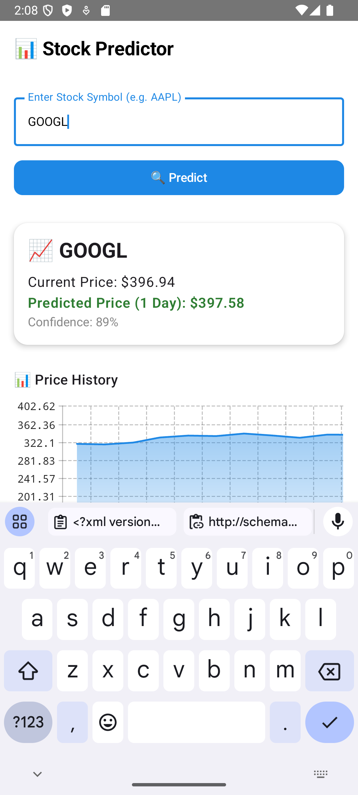
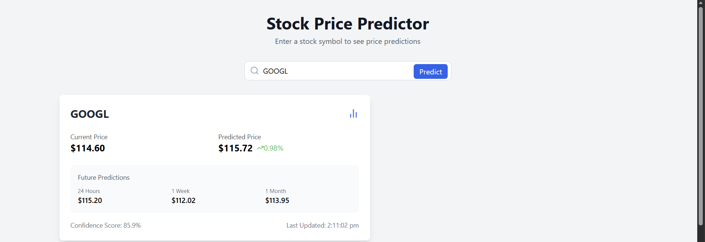
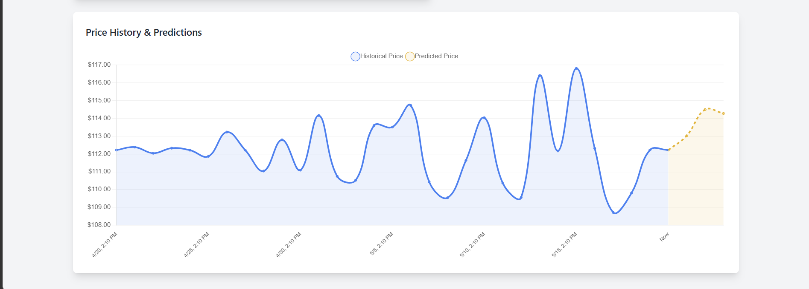

# Stock Predictor

A machine learning-based stock price prediction system that forecasts stock prices using historical market data. The project integrates an Android application, FastAPI backend, and React dashboard to provide real-time stock predictions and historical price analysis.

## Overview

The project consists of three major components:

- **Android Application (Kotlin + Jetpack Compose)** for stock search and prediction visualization
- **FastAPI Backend** for machine learning inference and stock prediction APIs
- **React Dashboard** for stock search, analytics and visualization

The system uses a **Random Forest Regression** model trained on historical stock market data fetched using Yahoo Finance.

---

## Features

### Android Application
- Built using **Kotlin** and **Jetpack Compose**
- Search stocks using ticker symbols (e.g., AAPL, TSLA, RELIANCE.NS)
- Real-time stock prediction display
- Historical stock price visualization
- Retrofit integration with FastAPI backend
- Clean and responsive UI

### FastAPI Backend
- RESTful API architecture
- Real-time stock market data using **Yahoo Finance (yFinance)**
- Automatic model training for new stock symbols
- Model persistence using Joblib
- CORS-enabled API for frontend integration

### Machine Learning
- **Random Forest Regression** model
- Feature engineering using:
  - Daily Returns
  - 5-Day Moving Average (MA5)
  - 20-Day Moving Average (MA20)
  - Volatility
  - Trading Volume
- Model trained on **1 year of historical stock data**

### React Dashboard
- Interactive stock prediction interface
- Historical and predicted stock price visualization
- Responsive UI built with **Tailwind CSS**
- Dynamic chart visualization

---

## Tech Stack

### Frontend
- Kotlin
- Jetpack Compose
- React.js
- TypeScript
- Tailwind CSS
- Chart.js
- Retrofit

### Backend
- Python
- FastAPI
- Uvicorn

### Machine Learning
- Scikit-learn
- Random Forest Regressor
- Pandas
- NumPy
- Joblib

### APIs & Data Source
- Yahoo Finance (yFinance)

### Tools
- Android Studio
- VS Code
- Git & GitHub
- Postman

---

## Machine Learning Workflow

The prediction model is trained using historical stock market data and engineered financial indicators.

### Features Used

| Feature | Description |
|----------|-------------|
| Returns | Percentage price change |
| MA5 | 5-day moving average |
| MA20 | 20-day moving average |
| Volatility | Rolling standard deviation |
| Volume | Trading volume |

### Workflow

1. Fetch historical stock data from Yahoo Finance
2. Generate financial indicators
3. Normalize data using `MinMaxScaler`
4. Train `RandomForestRegressor`
5. Save trained model locally
6. Generate predictions for requested stock symbols

---

## Project Structure

```bash
Stock_Predictor/
│
├── ml_backend/                 # FastAPI ML Backend
│   ├── main.py
│   ├── requirements.txt
│   ├── models/
│
├── StockPriceReact/            # React Dashboard
│   ├── src/
│   ├── package.json
│
├── StockPredictor/             # Android Application
│   ├── app/
│
├── screenshots/
│   ├── android-app.png
│   ├── web-top.png
│   └── web-bottom.png
│
└── README.md
```

---

## Screenshots

### Android Application

| Android App |
|--------------|
|  |

### Web Dashboard

| Dashboard - Top Section |
|--------------------------|
|  |

| Dashboard - Bottom Section |
|-----------------------------|
|  |

---

## Installation & Setup

### 1. Clone Repository

```bash
git clone https://github.com/aaditya8008/Stock_Predictor.git
cd Stock_Predictor
```

---

## Backend Setup (FastAPI)

Navigate to backend folder:

```bash
cd ml_backend
```

### Create Virtual Environment

#### Windows

```bash
python -m venv venv
venv\Scripts\activate
```

#### Mac/Linux

```bash
python -m venv venv
source venv/bin/activate
```

### Install Dependencies

```bash
pip install -r requirements.txt
```

### Run Backend Server

```bash
python -m uvicorn main:app --host 0.0.0.0 --port 8000
```

Backend URL:

```txt
http://localhost:8000
```

Swagger API Documentation:

```txt
http://localhost:8000/docs
```

---

## React Frontend Setup

Navigate to React project:

```bash
cd StockPriceReact
```

Install dependencies:

```bash
npm install
```

Run development server:

```bash
npm run dev
```

Frontend URL:

```txt
http://localhost:5173
```

---

## Android Application Setup

1. Open the Android project in **Android Studio**
2. Sync Gradle dependencies
3. Start the FastAPI backend server
4. Configure Retrofit base URL

### For Android Emulator

```kotlin
.baseUrl("http://10.0.2.2:8000/")
```

### For Physical Device

Replace with your system IPv4 address:

```kotlin
.baseUrl("http://YOUR_PC_IP:8000/")
```

Example:

```kotlin
.baseUrl("http://192.168.1.5:8000/")
```

Ensure:
- Phone and PC are connected to the same network
- Backend server is running
- Internet permission is enabled

---

## API Endpoint

### Predict Stock Price

```http
GET /predict/{symbol}
```

### Example Request

```http
GET /predict/AAPL
```

### Example Response

```json
{
  "symbol": "AAPL",
  "currentPrice": 213.52,
  "predictedPrice": 216.14,
  "confidence": 0.85,
  "timestamp": "2026-05-19T14:10:00",
  "predictions": {
    "oneDay": 216.14,
    "oneWeek": 218.90,
    "oneMonth": 223.45
  }
}
```

---

## Future Improvements

- LSTM-based deep learning prediction
- Technical indicators (RSI, MACD, Bollinger Bands)
- Portfolio tracking system
- Multi-stock comparison
- Real-time stock streaming
- Cloud deployment

---

## Author

**Aaditya Saini**  
B.Tech Computer Science Engineering  
Jaypee University of Information Technology

- GitHub: https://github.com/aaditya8008

---

## License

This project is licensed under the MIT License.
